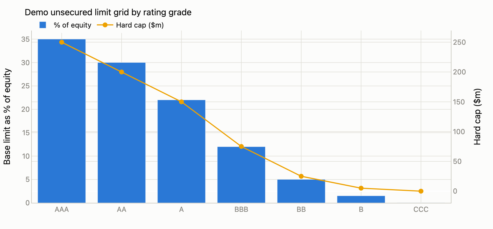
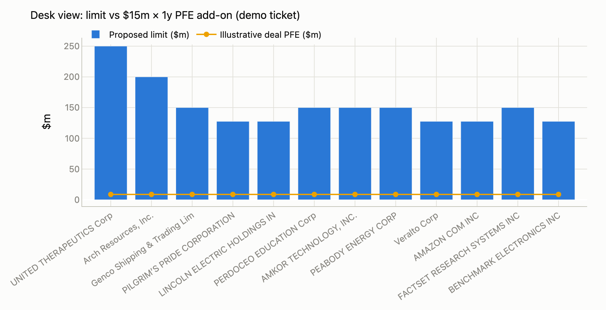
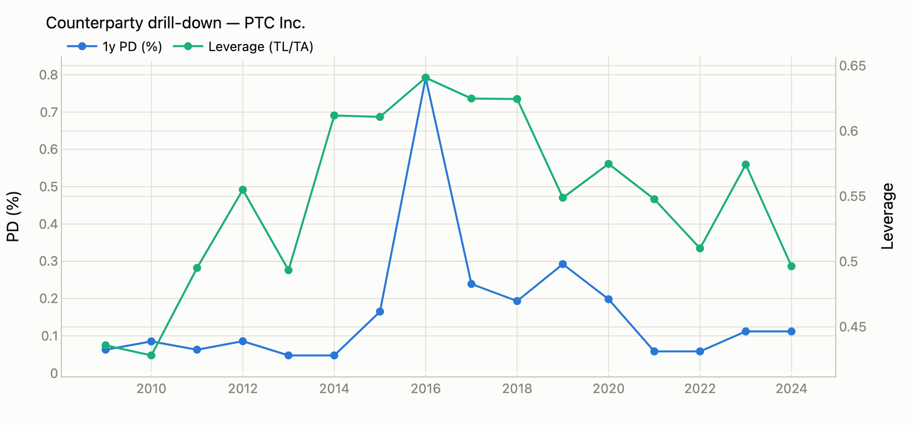
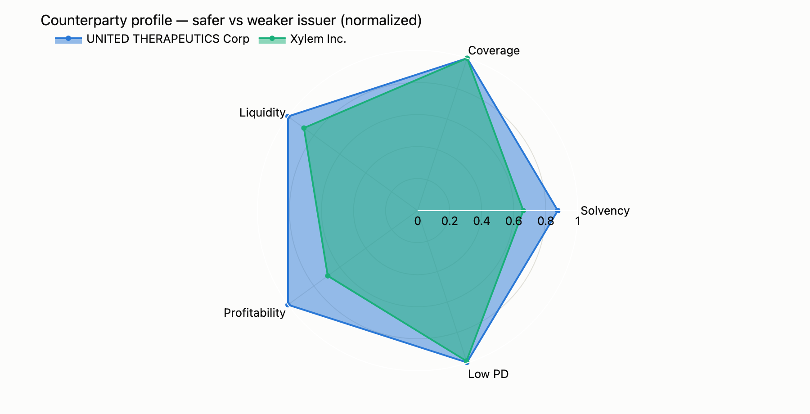
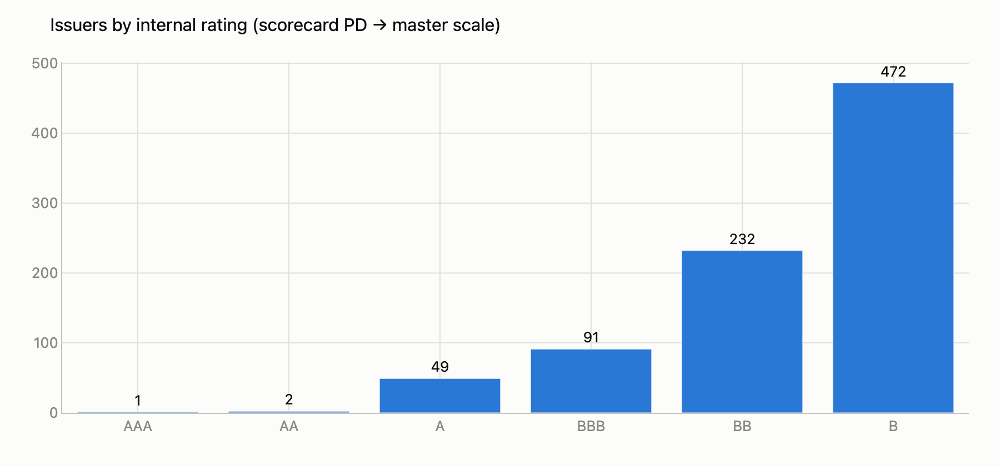
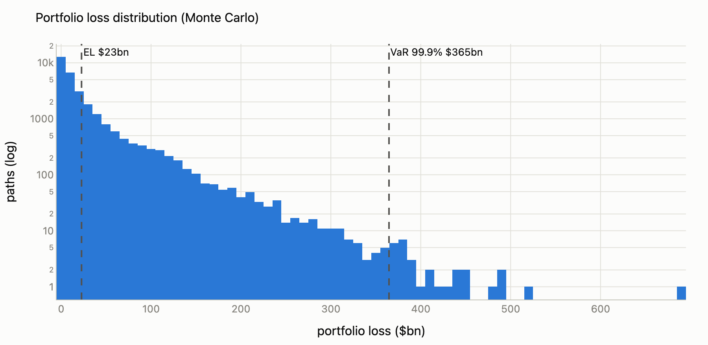
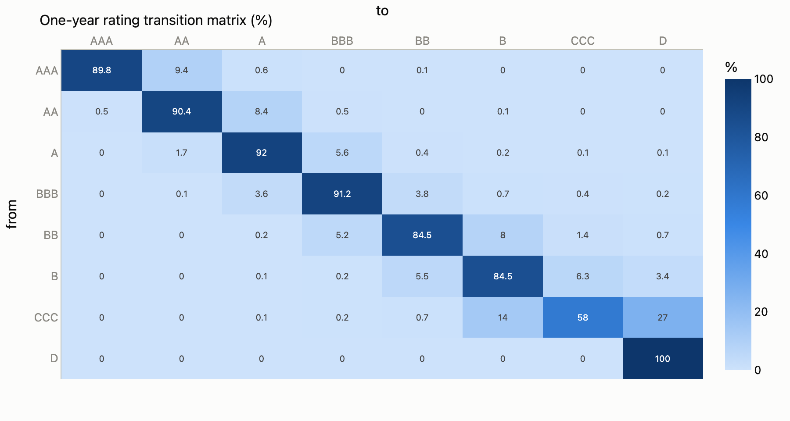

# CreditLab

**Trading-credit desk toolkit** for energy / commodity markets, built on a full corporate credit lab.

Primary workflow (matches energy-merchant **Credit Risk Analyst** work):

1. **Counterparty assessment** from financial statements (ratio flags + model PD / internal rating)  
2. **Unsecured limit recommendation** (transparent rating grid + haircuts + max tenor)  
3. **Documentation / KYC cues** (ISDA, CSA, PCG, monitoring intensity)  
4. **Pre-deal check** — simple PFE-style add-on vs limit headroom  
5. **FO credit memo** — plain-language opinion a trading desk can action  

Under the hood: SEC EDGAR firm-year panel, scorecard + ML PD models, Merton DtD, ratings / transitions, portfolio Monte Carlo, and IFRS 9 ECL — available as lab modules.

> **Portfolio project.** Educational / research use. Limit policy is pedagogical, not a live house methodology. Not investment advice.

---

## Visual gallery

Static charts exported from the models and desk tools (`uv run python scripts/export_gallery.py` → `docs/images/`).

### Trading credit desk

| Limit policy (demo grid) | Limit vs deal PFE |
| --- | --- |
|  |  |

| Counterparty PD & leverage history | Safer vs weaker issuer profile |
| --- | --- |
|  |  |

### Credit lab

| Issuers by internal rating | Portfolio loss distribution |
| --- | --- |
|  |  |

<p align="center">
  
</p>

<p align="center"><em>One-year rating transition matrix (agency-style anchors)</em></p>

Interactive versions live in the Streamlit app (`uv run streamlit run src/creditlab/dashboard.py`).

---

## Why this shape (trading credit, not bank IRB)

| Energy trading credit desk needs | CreditLab |
| --- | --- |
| Analyse counterparties via financials → **limits** | Scorecard PD + ratio flags + limit engine |
| FO partnership — clear yes / no / structure | FO memo generator |
| Trading docs (ISDA, CSA, PCG) | Doc pack by risk grade |
| Exposure vs limit (MtM / PFE intuition) | PFE add-on + headroom check |
| KYC status discipline | Demo KYC traffic light (clear / review / escalate) |
| Portfolio capital / IFRS 9 (secondary) | Lab pages still available |

---

## Quick start

```sh
git clone https://github.com/clearsmog/creditlab.git
cd creditlab
uv sync --group dev
```

### Trading credit desk (CLI)

Requires local `data/processed/panel.parquet` (build via EDGAR pipeline, or use your existing panel):

```sh
uv run python -m creditlab.counterparty.desk
uv run python -m creditlab.counterparty.desk --ticker KRP --notional 25000000 --tenor 1.5
uv run python -m creditlab.counterparty.desk --blotter limits.csv          # full-universe limit blotter
uv run python -m creditlab.counterparty.desk --offtaker municipal_utility  # unlisted-offtaker template, no panel needed
```

### Dashboard (default page = Trading credit desk)

```sh
uv run streamlit run src/creditlab/dashboard.py
```

| Page | Purpose |
| --- | --- |
| **Trading credit desk** | Counterparty → limit → FO memo → pre-deal utilisation |
| XVA — CVA/PFE | Simulated exposure & CVA via ORE — synthetic, real (FRED/NYMEX), or LSEG export with model-vs-market CVA (needs `--extra xva`) |
| Firm explorer | Ratio & PD history |
| Portfolio overview / risk | Book composition, Monte Carlo losses |
| Transitions | S&P-style matrix & cumulative PDs |
| IFRS 9 | Staging & scenario ECL (lab) |

### Tests

```sh
uv run pytest -q
```

### Regenerate README images

Requires a local firm-year panel at `data/processed/panel.parquet`:

```sh
uv run python scripts/export_gallery.py
# writes docs/images/01-*.png … 07-*.png
```

---

## Trading-credit module

```
src/creditlab/counterparty/
├── limits.py      # ratio flags, rating→limit grid, doc packs
├── exposure.py    # PFE add-on proxy, limit headroom
├── memo.py        # FO-facing markdown memo
├── peers.py       # energy peer sets (SIC) + ratio percentile context
├── offtakers.py   # unlisted-offtaker templates with shadow ratings
├── blotter.py     # full-universe limit blotter → CSV
└── desk.py        # CLI end-to-end demo

src/creditlab/xva/
├── marketdata.py  # synthetic market or real quotes (FRED + NYMEX NG)
├── configs.py     # minimal ORE input generation (curves, model, portfolio)
├── runner.py      # OREApp execution + report parsing
└── demo.py        # CLI: simulated CVA/PFE vs desk add-on proxy
```

### CVA/PFE via ORE (optional)

True counterparty risk on a gas netting set (forward + fixed-price swap):
Monte Carlo exposure under an LGM × Schwartz cross-asset model via
[ORE](https://www.opensourcerisk.org/), with the counterparty default curve
implied from the CreditLab model PD (`λ = -ln(1 - PD₁ᵧ)`).

```sh
uv sync --extra xva                                  # installs open-source-risk-engine
uv run python -m creditlab.xva.demo                  # synthetic market, PD 2%
uv run python -m creditlab.xva.demo --real --ticker KRP   # real market data
uv run python -m creditlab.xva.demo --pd 0.05 --tenor 5
```

Prints T0 NPVs, the quarterly EPE/PFE95 profile, netting-set CVA, and the
simulated peak PFE against the desk's `σ√T` add-on proxy.

`--real` swaps the synthetic market for free, keyless live data: US Treasury
par yields (FRED) as the discount curve, the NYMEX Henry Hub futures strip
(Yahoo Finance) as the forward curve, and realized vol from a year of
front-month history — cached under `data/processed/`. The real seasonal curve
produces a saw-tooth exposure profile (winter deliveries dominate), and with
realized gas vol near 100% the desk proxy at its default 35% vol understates
simulated peak PFE severalfold — the vol assumption dominates the model
choice. Caveats: par yields are used directly as zeros, and front-month
realized vol overstates long-dated vol (Samuelson effect), partly offset by
the Schwartz mean reversion.

### LSEG Workspace / Codebook data (optional, university access)

With LSEG Workspace access, run `notebooks/codebook_cds_pull.ipynb` inside
**Codebook** to export a USD SOFR zero curve, NG settlement strip, vol, and
single-name **CDS spread curves** as one JSON file; drop it in
`data/processed/` and point the demo at it:

```sh
uv run python -m creditlab.xva.demo --cds-file data/processed/lseg_export_YYYYMMDD.json --ticker OXY
# dry run without Workspace: --cds-file tests/fixtures/lseg_sample.json
```

When the counterparty has a CDS curve, ORE bootstraps a `SpreadCDS` default
curve and the demo prints CVA twice — scorecard hazard (real-world model PD)
vs CDS-implied (risk-neutral market pricing) — the model-vs-market gap that
drives desk CVA. Exports are licensed for personal academic use: keep them in
the gitignored `data/` tree, never in the repo.

### Agency ratings benchmark (optional, Capital IQ)

Validate the scorecard's internal ratings against real S&P issuer ratings:

```sh
# In S&P Capital IQ Pro: Screener → Companies →
#   criteria: "S&P Credit Rating" (Issuer Credit Rating, Local Currency LT) In [all]
#             AND Geography In United States
#   display columns: Ticker, S&P Credit Rating
#   Export → "Results As Values" → save to data/processed/capiq_ratings.xlsx
uv run python -m creditlab.validation.agency data/processed/capiq_ratings.xlsx
```

The screen exports the whole rated US universe; matching to the panel happens
locally — exact ticker first, then exact normalized company name (no fuzzy
matching; parent/subsidiary name collisions are excluded). The report shows
exact/within-one grade agreement, Spearman/Kendall rank correlation, signed
bias, a 7×7 confusion matrix, and the names ≥2 grades apart. Notched agency
ratings collapse onto the internal 7-grade scale; NR and D/SD names and
issuers with no filing in 3y are excluded. The loader reads CapIQ's xlsx or
CSV layouts. Dry run without access: `tests/fixtures/capiq_ratings_sample.csv`.

**Governance loop, run on real data (Jul 2026):** the first benchmark run
(75 matched names) showed the scorecard ~0.5 grades *lenient* vs S&P.
`--tune-ct` sweeps the calibration central tendency against the benchmark;
the bias zeroes at a 3% portfolio-average PD — consistent with a small-cap,
speculative-grade-heavy panel — so `CENTRAL_TENDENCY` was raised from 1.5%
to 3%. Post-remediation: exact grade agreement 28%→45%, within one grade
85%→93%, bias −0.57→−0.05, Spearman 0.65. Residual ≥2-grade outliers are
the known limits of a fundamentals-only model (business risk, scale,
event-driven credits).

### FAME private-counterparty book (optional, FAME/BvD)

UK energy trading counterparties are mostly *private* companies — no ticker,
no EDGAR filings. A FAME (Bureau van Dijk / Moody's) screening export puts
them through the same pipeline: scorecard PD → master-scale rating →
unsecured limit blotter, with FAME's own credit score riding along as an
external check.

```sh
# In FAME: Search → active companies AND UK SIC (2007) 35140 (electricity
#   trading) or 3523 (gas trading via mains) AND Turnover ≥ £10m.
# Add columns: Turnover, Total Assets, Shareholders Funds, Return on Total
#   Assets, Current ratio, Interest Cover, Gearing, Credit score
#   (all "th GBP / Last avail. yr") → Apply → Excel → Current view →
#   save to data/processed/fame_export.xlsx
uv run python -m creditlab.counterparty.fame data/processed/fame_export.xlsx
```

The loader maps FAME's th-GBP levels and percentage ratios onto the panel
schema (USD, decimals; missing "n.a." cells hit the WoE missing bin), scans
past FAME's "Search summary" sheet, and reads the styles openpyxl rejects
(calamine engine). Dry run without access: `tests/fixtures/fame_sample.csv`.

**Run on the real book (Jul 2026, 129 names):** the screen recovers the
actual GB desk universe — Octopus, SEFE Marketing & Trading, EDF Trading,
Drax, Centrica/British Gas entities, TotalEnergies Gas & Power. Face
validity is strong: Bulb Energy and People's Energy — both failed suppliers
— land at B (PD ≈ 5%), Storengy and E.ON Energy Solutions at A. Spearman
between model PD and FAME's credit score is −0.43 on 119 overlapping names
(negative = orientations agree). Printed caveat on every run: the scorecard
was developed on US listed issuers, so the UK-private application
demonstrates the mechanics, not a validated cross-population model.

### Limit policy (demo)

Transparent construction (replace with house policy in production):

1. Map model **1y PD → rating grade** (S&P-anchored master scale)  
2. **Base capacity** = min(equity × grade fraction, hard cap)  
3. Apply **haircuts** from leverage / coverage / liquidity / ROA flags  
4. Attach **max tenor** and **documentation pack** by grade  

CCC / weak names → **no unsecured line** (prepay / LC / full CSA).

### Pre-deal exposure (demo)

```
PFE_addon ≈ notional × σ × √T × z
```

Default σ = 35% (energy-ish placeholder). Use for *conversation*, not VaR sign-off.

---

## Architecture (full lab)

```
SEC EDGAR (+ optional private WRDS)
        │
        ▼
[1] data pipeline ──► firm-year panel (ratios + default labels)
        │
        ▼
[2] PD models ──────► Altman Z │ logistic scorecard │ ML challenger
        │
        ▼
[3] structural ─────► Merton distance-to-default
        │
        ▼
[4] ratings ────────► master scale │ transitions │ LGD
        │
        ├──────────────────────────────┐
        ▼                              ▼
[5a] TRADING DESK                 [5b] LAB
  limits · docs · FO memo           portfolio MC · IFRS 9 ECL
  PFE vs limit headroom
        │
        ▼
[6] Streamlit dashboard (desk-first navigation)
```

| Package | Role |
| --- | --- |
| `creditlab.counterparty` | **Trading desk:** limits, exposure, FO memo |
| `creditlab.data` | EDGAR ingest, panel, ratios, labels |
| `creditlab.models` | PD models, Merton, validation metrics |
| `creditlab.portfolio` | Transitions, simulation, economic capital |
| `creditlab.ecl` | IFRS 9 staging & scenario ECL |
| `creditlab.viz` | Plotly helpers |

---

## Data & licensing

| Source | Use |
| --- | --- |
| **SEC EDGAR XBRL API** | Primary fundamentals (public, license-clean) |
| **WRDS Compustat / CRSP** | Optional private enrichment — **do not redistribute** |
| **S&P / Moody’s published studies** | Transition / default-rate anchors |

`data/raw/` and `data/processed/` are **gitignored**. Respect SEC rate limits and User-Agent rules.

---

## Roadmap

- [x] Corporate panel + PD models + Merton + ratings  
- [x] Portfolio MC + IFRS 9 ECL + dashboard  
- [x] **Trading credit desk** (limits, PFE check, FO memo)  
- [x] Energy sector peer sets / commodity offtaker templates  
- [x] Optional CVA/PFE via ORE (true counterparty risk)  
- [x] Export limit blotter to CSV for “Credit Risk Cube”-style ops demos  
- [x] LSEG CDS-implied hazard curves (model-vs-market CVA)  
- [x] Agency ratings benchmark vs Capital IQ export  
- [x] Recalibration: central tendency 1.5%→3% (zeroed the S&P bias)  
- [x] FAME private-counterparty book (UK unlisted energy names)  

---

## Disclaimer

Illustrative only. Not a regulatory model, not a real credit decision, and not affiliated with any trading house. Do not use for live lending, trading limits, or capital without independent validation and governance.

---

## Author

**Qiankun (Kenny) Zhu** · FRM · [GitHub](https://github.com/clearsmog) · [LinkedIn](https://www.linkedin.com/in/kenny0908)

---

## License

All rights reserved until a `LICENSE` file is added.
